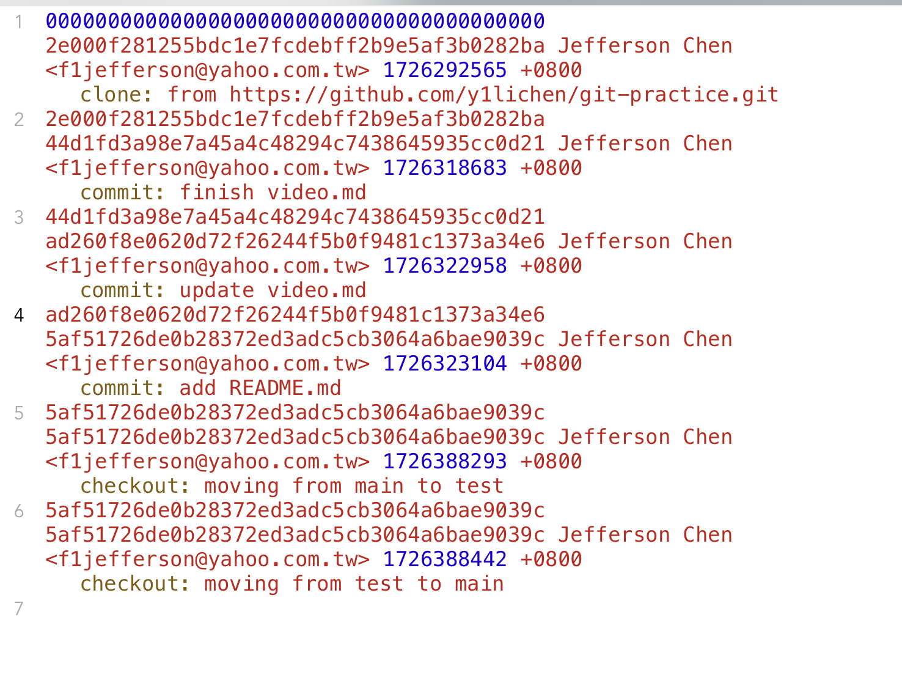
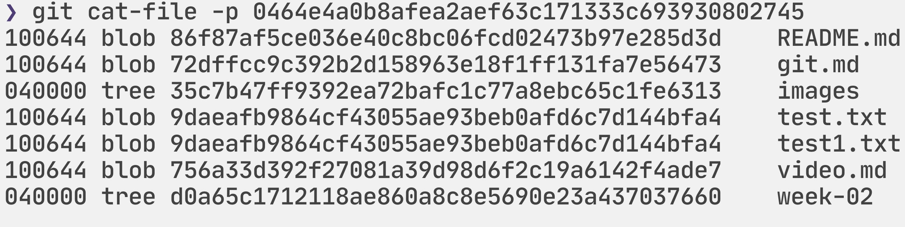
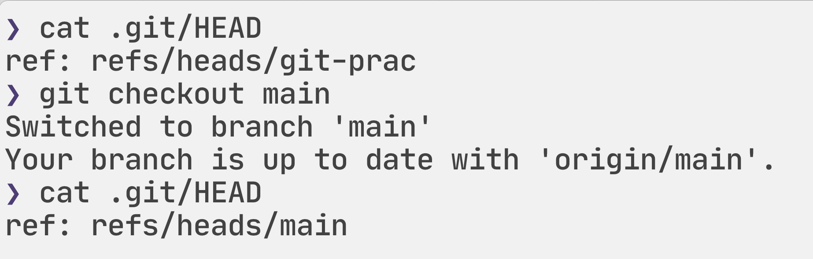

# 一、git相關名詞說明
1. blob
blob是git用來儲存文件內容的單位。每一個文件的內容都以一個blob被儲存，而每一個blob都有一個（sha-1）的hash value。blob只記錄文件內容並不記錄檔名等額外資訊，因此兩個同內容的檔案會有相同的blob。
2. tree
blob只儲存了文件內容，而檔案名稱則由tree來管理。tree會記錄blob和其對應的檔名。tree除了可記錄blob外，也可以記錄tree（**有子目錄時**）。
3. commit
在每次commit後會產生commit object，其中包含了用來表示當前commit文件結構的tree、author、提交commit的人、commit time、commit message等資訊。
此外，commit object還記錄了前一個commit object，如此一來就能串起整個commit history。
4. branch
branch指向不同commit，每一個branch都是獨立的路徑，讓開發者可以在一個repo並行開發不同功能，互不影響。branch指向的commit都是branch的最後commit，每次有新的提交時，分支會指向新的commit。
5. head
head可以指向某個branch或commit。如果head指向branch時，代表指向來是某個branch的最新commit；若直接指向某個commit，代表處在detached狀態，表示目前操作不在任何branch上。

# 紀錄在 git repo 操作過程中，.git 檔案夾裡的變化

### git init:
- 生成.git檔案夾
- HEAD file中存目前所指的branch
- objects檔案夾存blob、tree、commit等物件
- logs存操作日誌

- refs存branch、tag
### git add <file>:
- 文件內容存為blob，會存到objects檔案夾內
- 同內容的檔案會有同樣的hash value

#### 怎麼證明同內容的檔案會有同樣的hash value？
查看前一次commit的內容
```
git cat-file -p <hash value of last commit>
```
查看前一次commit內容中tree中的blob
```
git cat-file -p <hash value of tree>
```
以下為test.txt、test1.txt的hash value，兩者的內容同為"test"


### git commit:
- 生成commit object，會存到objects檔案夾內
- COMMIT_EDITMSG存前一個commit message
- commit相關的tree也會被存到objects
- .git/refs/heads/<branch name>文件會指向新commit
### git branch:
- .git/refs/heads/中會新增一個以新branch為名的文件，記錄該branch所指的commit的hash value
### git checkout:
- HEAD file所指的branch會更新

### git merge:
- .git/refs/heads/<branch name>文件會指向merge進來的新commit
### git pull:
- 遠端的變更會合併到本地，新的commit會存到objects
# 二、commit message 應該怎麼寫比較好？應該有什麼 style 嗎？
commit message沒有一定要怎麼寫比較好，而每個團隊可能也會有自己習慣的style。
過去我自己的習慣是會在commit message說明做了什麼更動並標註相關的issue。 
 
 在我查了網路資料後，我認為好的commit message中可以包含commit的種類、做了什麼更動、*為什麼要做這些更動*。
 種類的部分可以把commit分成以下：
 - feat：新增、修改的feature
 - fix：修正了什麼功能
 - refactor：針對程式碼的重構
 - doc：新增文件 
 
 commit種類劃分依專案需求可能會有所不同。
 
 而為什麼要做這些更動是自己過去的commit message所缺少的。需要有「為什麼要做這些更動」的原因在於一段時間後要回顧commit history時才不會在看到「做了什麼更動」時覺得不明不白為什麼要做這項更動。
