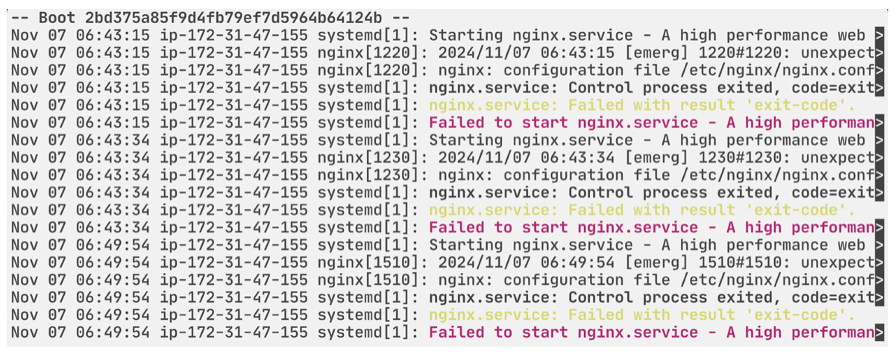
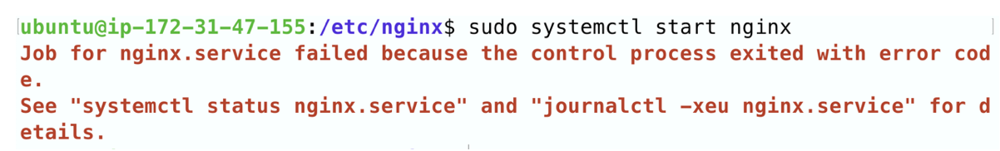
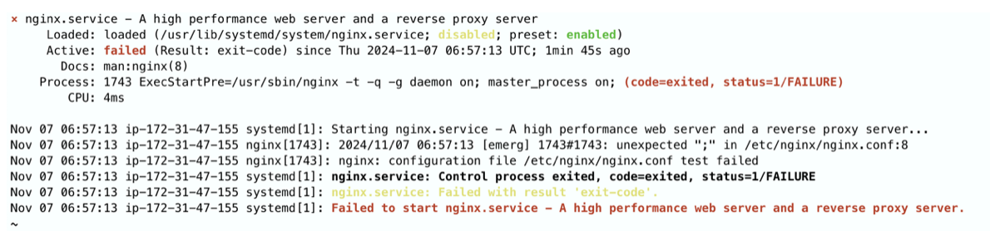
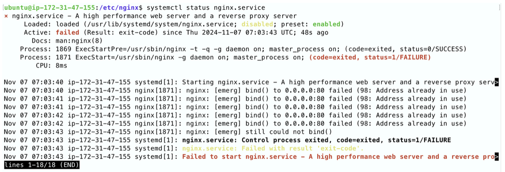
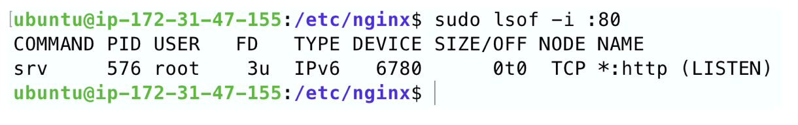
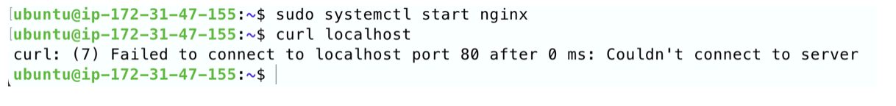
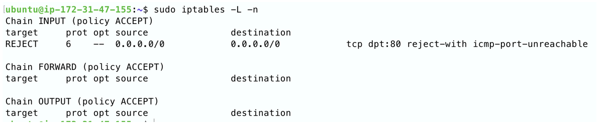
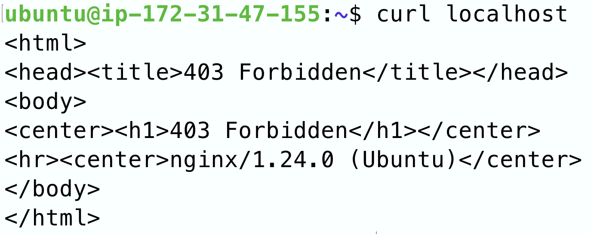
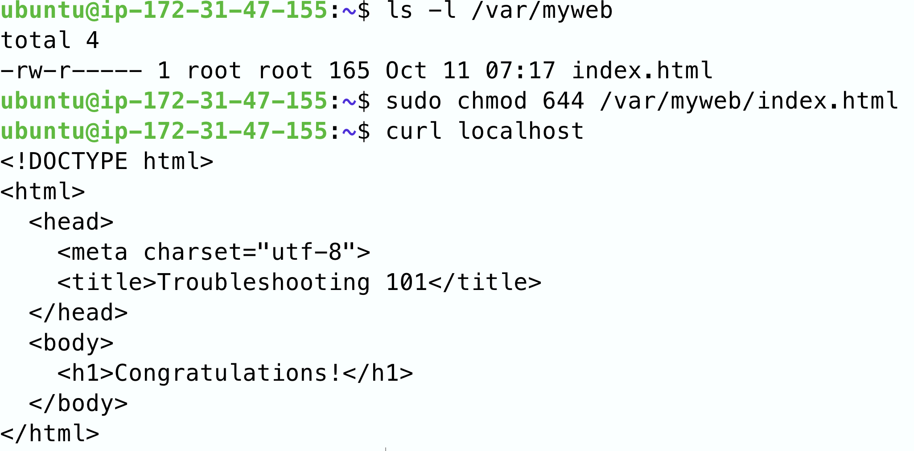

# 問題一：nginx 無法啟動
## 1. 執行sudo journalctl -u nginx.service看log



確認問題和nginx有關

## 2. 試著啟動nginx



## 3. 依提示執行systemctl status nginx.service查看



看來/etc/nginx/nginx.conf的第8行多了一個;

# 問題二：無法連上 nginx

## 4. 修正nginx.conf的第8行後再啟動一次nginx，問題仍然存在。執行systemctl status nginx.service查看：



看來80 port 被佔用了

## 5. 執行 sudo lsof -i :80，查看佔用80 port 的程序。



## 6.

``` 
sudo systemctl stop srv
sudo systemctl disable srv
```
## 7. 再次啟動nginx



80 port 已經不被佔用，而無法連線上 80 port 顯示可能是防火牆擋下。

## 8. 執行sudo iptables -L -n，查看防火牆規則



## 9. 關掉這條將 80 port 的流量 reject 的規則。

執行`sudo iptables -D INPUT 1。`

## 10. 再次啟動 nginx 後正常，但機器 reboot 後仍遇到同問題

## 11. 重啟 ip 規則被重置
執行以下永久保持 ip 規則
```
sudo chmod 777 /etc/iptables/rules.v4
sudo iptables-save > /etc/iptables/rules.v4
```
# 問題四：403 error
## 12.


## 13. 給予網頁權限
```
ls -l /var/myweb #查看檔案權限
sudo chmod 644 /var/myweb/index.html #給予所有人查看權限
```
